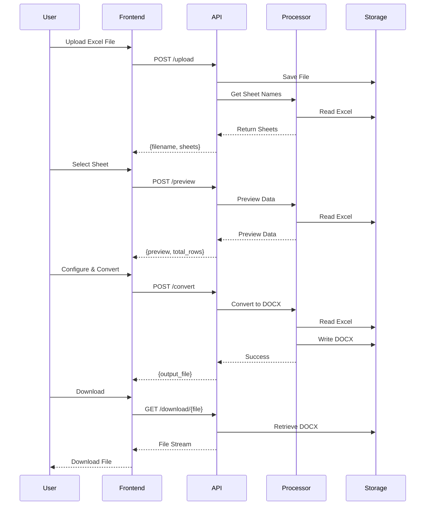

# Excel to DOCX Converter
A powerful, production-ready web application that converts Excel spreadsheets to formatted Word documents with intelligent column selection and data range configuration.

---

## 📋 Table of Contents

- [Introduction](#-introduction)
- [Key Features](#-key-features)
- [Overall Architecture](#-overall-architecture)
- [Installation](#-installation)
- [Running the Project](#-running-the-project)
- [Environment Configuration](#-environment-configuration)
- [Folder Structure](#-folder-structure)
- [API Documentation](#-api-documentation)
- [Contribution Guidelines](#-contribution-guidelines)
- [License](#-license)
- [Roadmap](#-roadmap)

---

## 🌟 Introduction

**Excel to DOCX Converter** is a web-based solution designed to streamline the process of converting Excel data into professionally formatted Word documents. Whether you're working with employee lists, inventory data, or any tabular information, this tool provides an intuitive interface to select specific columns, define data ranges, and generate clean DOCX files.

Built with **FastAPI** for blazing-fast performance and **Docker** for seamless deployment, this application is perfect for businesses, data analysts, and anyone who needs to transform spreadsheet data into document format regularly.

### Why This Tool?

- **No Manual Copy-Paste**: Automate the tedious process of transferring Excel data to Word
- **Selective Export**: Choose exactly which columns you need
- **Flexible Data Ranges**: Define custom header rows and data boundaries
- **Batch Processing**: Handle large datasets efficiently
- **Self-Hosted**: Keep your sensitive data secure on your own infrastructure

---

## ✨ Key Features

### Core Functionality

- **Excel Upload**: Support for `.xlsx` and `.xls` files up to 50MB
- **Multi-Sheet Support**: Work with any sheet in your workbook
- **Live Preview**: View your data before conversion with customizable row limits
- **Smart Column Selection**: 
  - Select/deselect individual columns
  - Bulk select/deselect all columns
  - Visual column counter
- **Flexible Configuration**:
  - Custom header row selection
  - Configurable data start row
  - Optional data end row (or process entire sheet)
- **Merged Cell Handling**: Intelligent processing of merged Excel cells
- **Formatted DOCX Output**: Clean, readable Word documents with proper formatting

### Technical Excellence

- **High Performance**: Built on FastAPI for asynchronous processing
- **Docker Ready**: One-command deployment with Docker Compose
- **Auto Cleanup**: Scheduled cleanup of old files to save disk space
- **API Documentation**: Interactive Swagger UI and ReDoc documentation
- **Health Checks**: Built-in health monitoring endpoints
- **Security**: Input validation and file type restrictions

---

## Overall Architecture

### Request Flow



### Technology Stack

| Layer | Technology | Purpose |
|-------|-----------|---------|
| **Backend Framework** | FastAPI 0.109.0 | High-performance async API |
| **Server** | Uvicorn | ASGI web server |
| **Data Processing** | Pandas 2.3.3 | DataFrame operations |
| **Excel Reading** | OpenPyXL 3.1.5 | Excel file parsing |
| **Word Generation** | Python-DOCX 1.1.0 | DOCX file creation |
| **Frontend** | HTML5/CSS3/Vanilla JS | Interactive UI |
| **Containerization** | Docker & Docker Compose | Deployment |
| **Web Server** | Nginx (optional) | Reverse proxy |

---

## Installation

### Prerequisites

Before you begin, ensure you have the following installed:

- **Python 3.9+** ([Download](https://www.python.org/downloads/))
- **pip** (comes with Python)
- **Docker** (optional, for containerized deployment) ([Download](https://www.docker.com/get-started))
- **Docker Compose** (optional, included with Docker Desktop)

### Option 1: Local Installation

#### 1. Clone the Repository

```bash
git clone https://github.com/yourusername/excel-to-docx-converter.git
cd excel-to-docx-converter
```

#### 2. Create Virtual Environment

```bash
# On Windows
python -m venv venv
venv\Scripts\activate

# On macOS/Linux
python3 -m venv venv
source venv/bin/activate
```

#### 3. Install Dependencies

```bash
pip install -r requirements.txt
```

#### 4. Create Required Directories

```bash
# On Windows
mkdir uploads outputs templates

# On macOS/Linux
mkdir -p uploads outputs templates
```

#### 5. Move HTML Template

```bash
# Ensure index.html is in the templates folder
# The file should be at: templates/index.html
```

### Option 2: Docker Installation

#### 1. Clone the Repository

```bash
git clone https://github.com/yourusername/excel-to-docx-converter.git
cd excel-to-docx-converter
```

#### 2. Build and Run with Docker Compose

```bash
# Build and start the container
docker-compose up -d

# View logs
docker-compose logs -f

# Stop the container
docker-compose down
```

The application will be available at `http://localhost:8080`

---

## 🎮 Running the Project

### Local Development

#### Start the Server

```bash
# Make sure virtual environment is activated
uvicorn main:app --reload --host 0.0.0.0 --port 8080
```

**Parameters:**
- `--reload`: Auto-restart on code changes (development only)
- `--host 0.0.0.0`: Listen on all network interfaces
- `--port 8080`: Port number

#### Access the Application

- **Web UI**: http://localhost:8080
- **API Docs (Swagger)**: http://localhost:8080/docs
- **API Docs (ReDoc)**: http://localhost:8080/redoc
- **Health Check**: http://localhost:8080/health

#### Access from Other Devices

The application will display the local network IP on startup:

```
TRUY CẬP TỪ MÁY KHÁC CÙNG MẠNG:
   → http://192.168.1.100:8080
```

### Production Deployment

#### Using Docker Compose

```bash
# Start in detached mode
docker-compose up -d

# Scale if needed (not recommended for this app)
docker-compose up -d --scale excel-converter=1

# Update after code changes
docker-compose build
docker-compose up -d
```

#### With Nginx Reverse Proxy

```bash
# Start with nginx profile
docker-compose --profile with-nginx up -d
```

This will:
- Run the app on port 8080
- Run Nginx on ports 80/443
- Configure SSL (if certificates are provided)

#### System Service (Linux)

Create `/etc/systemd/system/excel-converter.service`:

```ini
[Unit]
Description=Excel to DOCX Converter
After=network.target

[Service]
Type=simple
User=www-data
WorkingDirectory=/opt/excel-converter
Environment="PATH=/opt/excel-converter/venv/bin"
ExecStart=/opt/excel-converter/venv/bin/uvicorn main:app --host 0.0.0.0 --port 8080
Restart=always

[Install]
WantedBy=multi-user.target
```

Enable and start:

```bash
sudo systemctl enable excel-converter
sudo systemctl start excel-converter
sudo systemctl status excel-converter
```

---

## Environment Configuration

### Environment Variables

Create a `.env` file in the project root:

```bash
# Application Settings
FASTAPI_ENV=production          # development | production
MAX_FILE_SIZE=52428800          # 50MB in bytes
CLEANUP_HOURS=24                # Auto-delete files older than X hours

# Folders
UPLOAD_FOLDER=uploads
OUTPUT_FOLDER=outputs

# File Settings
ALLOWED_EXTENSIONS=.xlsx,.xls

# Server
TZ=Asia/Ho_Chi_Minh            # Timezone
```

### Docker Environment Variables

In `docker-compose.yml`:

```yaml
environment:
  - FASTAPI_ENV=production
  - MAX_FILE_SIZE=52428800
  - CLEANUP_HOURS=24
  - TZ=Asia/Ho_Chi_Minh
```

### Configuration Options

| Variable | Default | Description |
|----------|---------|-------------|
| `FASTAPI_ENV` | `production` | Environment mode |
| `MAX_FILE_SIZE` | `52428800` | Max upload size (bytes) |
| `CLEANUP_HOURS` | `24` | File retention period |
| `UPLOAD_FOLDER` | `uploads` | Upload directory |
| `OUTPUT_FOLDER` | `outputs` | Output directory |
| `ALLOWED_EXTENSIONS` | `.xlsx,.xls` | Allowed file types |
| `TZ` | `Asia/Ho_Chi_Minh` | Timezone |

---

## Folder Structure

```
excel-to-docx-converter/
│
├── 📄 main.py                    # FastAPI application & routes
├── 📄 excel_processor.py         # Core business logic
├── 📄 requirements.txt           # Python dependencies
├── 📄 Dockerfile                 # Docker image configuration
├── 📄 docker-compose.yml         # Docker Compose orchestration
├── 📄 .dockerignore              # Docker build exclusions
├── 📄 .gitignore                 # Git exclusions
├── 📄 .env                       # Environment variables (create this)
├── 📄 README.md                  # This file
│
├── 📁 templates/                 # Frontend templates
│   └── 📄 index.html             # Main web interface
│
├── 📁 uploads/                   # Uploaded Excel files (auto-created)
│   └── .gitkeep
│
├── 📁 outputs/                   # Generated DOCX files (auto-created)
│   └── .gitkeep
│
├── 📁 nginx/                     # Nginx configuration (optional)
│   ├── 📄 nginx.conf
│   └── 📁 ssl/
```

##  API Documentation

### Interactive Documentation

Once the server is running, access the interactive API documentation:

- **Swagger UI**: http://localhost:8080/docs
- **ReDoc**: http://localhost:8080/redoc

### Core Endpoints

#### 1. Upload File

```http
POST /upload
Content-Type: multipart/form-data

file: <Excel file>
```

**Response:**
```json
{
  "filename": "data_20240114_153045.xlsx",
  "sheets": ["Sheet1", "Sheet2"],
  "file_size": "245.3 KB"
}
```

#### 2. Preview Sheet

```http
POST /preview
Content-Type: application/json

{
  "filename": "data_20240114_153045.xlsx",
  "sheet": "Sheet1",
  "num_rows": 10
}
```

**Response:**
```json
{
  "preview": [
    ["Name", "Email", "Phone"],
    ["John Doe", "john@example.com", "123-456"]
  ],
  "total_rows": 150,
  "total_cols": 3
}
```

#### 3. Get Columns

```http
POST /get-columns
Content-Type: application/json

{
  "filename": "data_20240114_153045.xlsx",
  "sheet": "Sheet1",
  "header_row": 2
}
```

**Response:**
```json
{
  "columns": ["Name", "Email", "Phone", "Address"]
}
```

#### 4. Convert to DOCX

```http
POST /convert
Content-Type: application/json

{
  "filename": "data_20240114_153045.xlsx",
  "sheet": "Sheet1",
  "columns": ["Name", "Email"],
  "header_row": 2,
  "data_start_row": 3,
  "data_end_row": 100
}
```

**Response:**
```json
{
  "success": true,
  "output_file": "output_20240114_154530.docx",
  "row_count": 97,
  "column_count": 2,
  "message": "Đã xuất thành công 97 bản ghi với 2 cột"
}
```

#### 5. Download File

```http
GET /download/{filename}
```

Returns the DOCX file for download.

---

## 📄 License

This project is licensed under the **MIT License**.

```
MIT License

Copyright (c) 2024 Excel to DOCX Converter

Permission is hereby granted, free of charge, to any person obtaining a copy
of this software and associated documentation files (the "Software"), to deal
in the Software without restriction, including without limitation the rights
to use, copy, modify, merge, publish, distribute, sublicense, and/or sell
copies of the Software, and to permit persons to whom the Software is
furnished to do so, subject to the following conditions:

The above copyright notice and this permission notice shall be included in all
copies or substantial portions of the Software.

THE SOFTWARE IS PROVIDED "AS IS", WITHOUT WARRANTY OF ANY KIND, EXPRESS OR
IMPLIED, INCLUDING BUT NOT LIMITED TO THE WARRANTIES OF MERCHANTABILITY,
FITNESS FOR A PARTICULAR PURPOSE AND NONINFRINGEMENT. IN NO EVENT SHALL THE
AUTHORS OR COPYRIGHT HOLDERS BE LIABLE FOR ANY CLAIM, DAMAGES OR OTHER
LIABILITY, WHETHER IN AN ACTION OF CONTRACT, TORT OR OTHERWISE, ARISING FROM,
OUT OF OR IN CONNECTION WITH THE SOFTWARE OR THE USE OR OTHER DEALINGS IN THE
SOFTWARE.
```

## Support

### Getting Help

- **Documentation**: Read this README thoroughly
- **API Docs**: Check http://localhost:8080/docs
- **Issues**: [GitHub Issues](https://github.com/yourusername/excel-to-docx-converter/issues)
- **Discussions**: [GitHub Discussions](https://github.com/yourusername/excel-to-docx-converter/discussions)

### Reporting Bugs

When reporting bugs, please include:
1. Excel file characteristics (size, structure)
2. Steps to reproduce
3. Expected vs actual behavior
4. Screenshots if applicable
5. Browser/OS information
6. Server logs (if available)

---

## Acknowledgments

Built with open-source technologies:

- [FastAPI](https://fastapi.tiangolo.com/) - Modern web framework
- [Pandas](https://pandas.pydata.org/) - Data analysis library
- [OpenPyXL](https://openpyxl.readthedocs.io/) - Excel file handling
- [Python-DOCX](https://python-docx.readthedocs.io/) - Word document generation
- [Uvicorn](https://www.uvicorn.org/) - ASGI server

---

<div align="center">

[Report Bug](https://github.com/yourusername/excel-to-docx-converter/issues) · [Request Feature](https://github.com/yourusername/excel-to-docx-converter/issues) · [Documentation](https://github.com/yourusername/excel-to-docx-converter/wiki)

</div>