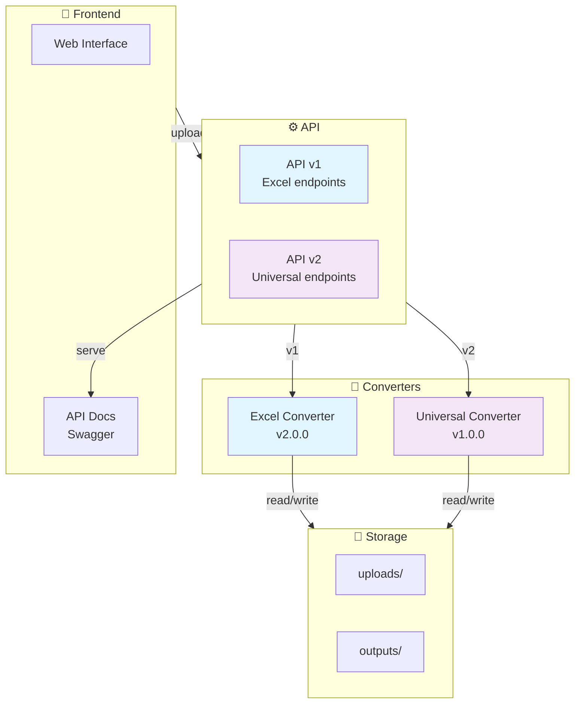
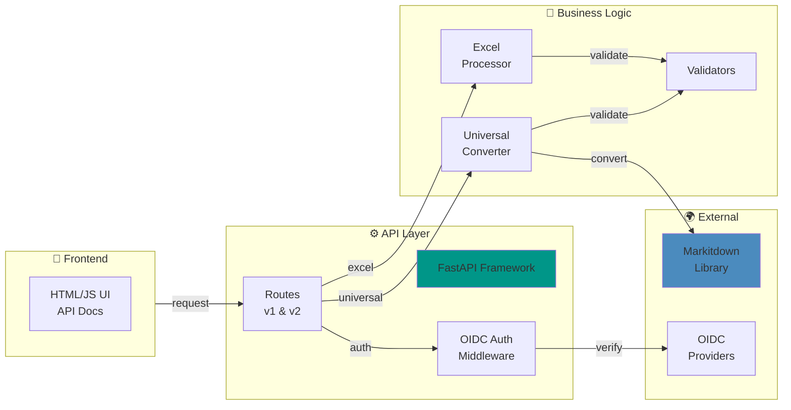

# � Universal File Converter

<div align="center">

[](https://fastapi.tiangolo.com)
[](https://python.org)
[](https://github.com/microsoft/markitdown)
[](https://docker.com)
[](./LICENSE)

**Ứng dụng chuyển đổi file toàn năng hỗ trợ 30+ định dạng: PDF, DOCX, Excel, Images, Code, Notebooks, và nhiều hơn nữa**

[Tính Năng](#-tính-năng) • [Cài Đặt](#-cài-đặt) • [API Docs](#-tài-liệu-api) • [Ví Dụ](#-ví-dụ) • [Đóng Góp](#-hướng-dẫn-đóng-góp)

</div>

---

## 📋 Mục Lục

- [Giới Thiệu](#-giới-thiệu)
- [Tính Năng](#-tính-năng)
- [Các Định Dạng Hỗ Trợ](#-các-định-dạng-hỗ-trợ)
- [Kiến Trúc Tổng Thể](#-kiến-trúc-tổng-thể)
- [Cài Đặt](#-cài-đặt)
- [Chạy Dự Án](#-chạy-dự-án)
- [Cấu Hình Biến Môi Trường](#-cấu-hình-biến-môi-trường)
- [Cấu Trúc Thư Mục](#-cấu-trúc-thư-mục)
- [Tài Liệu API](#-tài-liệu-api)
- [Ví Dụ Sử Dụng](#-ví-dụ-sử-dụng)
- [Hướng Dẫn Đóng Góp](#-hướng-dẫn-đóng-góp)
- [Giấy Phép](#-giấy-phép)

---

## 🌟 Giới Thiệu

**Universal File Converter** là giải pháp web được thiết kế để chuyển đổi **bất kỳ loại file nào sang Markdown** hoặc các định dạng khác. Dự án tích hợp hai module mạnh mẽ:

1. **Excel Converter** - Convert Excel sang DOCX/Markdown với giao diện trực quan
2. **Universal Converter** - Chuyển đổi 30+ loại file (PDF, Images, Code, Notebooks, etc.) sang Markdown

Được xây dựng với **FastAPI** cho hiệu suất cao, **Markitdown** cho khả năng chuyển đổi đa định dạng, và **Docker** cho triển khai dễ dàng.

### 🎯 Trường Hợp Sử Dụng

- 📊 **Excel → DOCX** - Tạo báo cáo từ dữ liệu Excel
- 📄 **PDF → Markdown** - Trích xuất content từ PDF sang dạng văn bản
- 🖼️ **Images → Text** - OCR hình ảnh thành Markdown (AI-powered)
- 💻 **Code → Markdown** - Chuyển đổi file code thành documentation
- 📊 **PowerPoint → Markdown** - Extract slides thành Markdown
- 📓 **Jupyter → Markdown** - Convert notebooks thành posts
- 🌐 **HTML/Web → Markdown** - Clean web content extraction

---

## ✨ Tính Năng

### 🔧 Module 1: Excel Converter
- ✅ Upload file Excel (.xlsx) lên server
- ✅ Xem trước dữ liệu real-time
- ✅ Chọn sheets và cột cụ thể
- ✅ Convert sang DOCX được định dạng
- ✅ Convert sang Markdown table format
- ✅ Download file đã convert

### 🌍 Module 2: Universal Converter
- ✅ Hỗ trợ 30+ định dạng input file
- ✅ Convert bất kỳ file nào sang Markdown
- ✅ Batch conversion (chuyển đổi hàng loạt)
- ✅ File type detection tự động
- ✅ Hỗ trợ AI vision (PDF, Images)
- ✅ Xử lý file lớn (tối đa 100MB)

### 🔐 Bảo Mật & Xác Thực
- ✅ OAuth 2.0 OIDC (Google, Keycloak)
- ✅ Session management
- ✅ CORS protection
- ✅ File validation

### 📊 Quản Lý Files
- ✅ Upload tự động tạo folder uploads/
- ✅ Output lưu vào outputs/
- ✅ Auto cleanup (24h)
- ✅ Download link tạo tự động

---

## 📁 Các Định Dạng Hỗ Trợ

### 📄 Documents
```
PDF, DOCX, DOC, TXT, MD
```

### 📊 Spreadsheets  
```
XLSX, XLS, CSV
```

### 🎞️ Presentations
```
PPTX, PPT
```

### 🌐 Web & Data
```
HTML, JSON, XML, RSS, EPUB
```

### 🖼️ Images
```
PNG, JPG, JPEG, GIF, BMP, WEBP, SVG
```

### 💻 Code & Notebooks
```
IPYNB (Jupyter), PY, R, RMD, JS, TS, JAVA, CPP, C
```

### 📧 Messages & Archives
```
MSG (Outlook), EPUB
```

---

## 🏗️ Kiến Trúc Tổng Thể

### 📊 Sơ Đồ Module



### 🔗 API Architecture


        Temp["Temp Files"]
    end
    
    UI -->|HTTP Requests| Routes
    Routes -->|Render| Templates
    Routes -->|Process| Auth
    Auth -->|Authorized| Processor
    Processor -->|Read| Uploads
    Processor -->|Validate| Validator
    Processor -->|Convert| Converter
    Converter -->|Write| Outputs
    Processor -->|Cleanup| Temp
```

---

## 📦 Cài Đặt

### ✅ Yêu Cầu Tiên Quyết

- **Python**: 3.8 hoặc cao hơn
- **Docker**: (Tùy chọn, cho triển khai container)
- **Git**: Để clone repository

### 🚀 Cài Đặt Cơ Bản

#### 1. Clone Repository

```bash
git clone https://github.com/yourusername/convert-tool.git
cd convert_tool/convert_excel
```

#### 2. Tạo Virtual Environment

```bash
# Windows
python -m venv venv
venv\Scripts\activate

# macOS/Linux
python3 -m venv venv
source venv/bin/activate
```

#### 3. Cài Đặt Các Phụ Thuộc

```bash
pip install -r requirements.txt
```

#### 4. Cấu Hình Biến Môi Trường

```bash
# Copy file example
cp .env.example .env

# Chỉnh sửa .env với các giá trị của bạn
nano .env
```

### 🐳 Cài Đặt Bằng Docker

#### 1. Xây Dựng Docker Image

```bash
docker build -t excel-converter:latest .
```

#### 2. Chạy Container

```bash
docker run -p 8080:8080 \
  -v $(pwd)/uploads:/app/uploads \
  -v $(pwd)/outputs:/app/outputs \
  -e HOST=0.0.0.0 \
  -e PORT=8080 \
  excel-converter:latest
```

#### 3. Sử Dụng Docker Compose (Khuyến Nghị)

```bash
docker-compose up -d
```

---

## ▶️ Chạy Dự Án

### 🏃 Chạy Ở DEV

```bash
# Kích hoạt virtual environment (nếu chưa kích hoạt)
source venv/bin/activate  # hoặc venv\Scripts\activate trên Windows

# Chạy với Uvicorn
uvicorn main:app --reload --host 0.0.0.0 --port 8080
```

Sau đó truy cập ứng dụng tại: **http://localhost:8080**

### 📚 Truy Cập Tài Liệu API

- **Swagger UI**: http://localhost:8080/docs
- **ReDoc**: http://localhost:8080/redoc

### 🏗️ Chạy Ở Chế Độ Sản Xuất

```bash
# Sử dụng Gunicorn với Uvicorn workers
gunicorn main:app \
  --workers 4 \
  --worker-class uvicorn.workers.UvicornWorker \
  --bind 0.0.0.0:8080 \
  --access-logfile - \
  --error-logfile -
```

---

## 🔐 Cấu Hình Biến Môi Trường

Tạo file `.env` dựa trên `.env.example`:

```dotenv
# ============================================================================
# Excel to DOCX Converter - Cấu Hình Biến Môi Trường
# ============================================================================

# Ứng Dụng
FASTAPI_ENV=production              # Môi trường: development, production
APP_NAME=convert-tool               # Tên ứng dụng
APP_VERSION=2.0.0                   # Phiên bản ứng dụng

# Server
HOST=0.0.0.0                        # Địa chỉ lắng nghe
PORT=8080                           # Cổng lắng nghe

# Dọn Dẹp File
CLEANUP_HOURS=24                    # Xóa file cũ hơn X giờ
CLEANUP_INTERVAL=3600               # Kiểm tra mỗi X giây

# Múi Giờ
TZ=Asia/Ho_Chi_Minh                 # Múi giờ ứng dụng

# Bảo Mật (Tùy Chọn)
SECRET_KEY=your-secret-key-here     # Khóa bí mật cho sessions
CORS_ORIGINS=http://localhost:3000  # CORS origins cho cross-origin requests

# Logging
LOG_LEVEL=info                      # Mức độ logging: debug, info, warning, error

# OAuth / OpenID Connect (Tùy Chọn)
GOOGLE_CLIENT_ID=your-google-client-id
GOOGLE_CLIENT_SECRET=your-google-client-secret
KEYCLOAK_SERVER_URL=https://keycloak.example.com
KEYCLOAK_REALM=your-realm
KEYCLOAK_CLIENT_ID=your-client-id
KEYCLOAK_CLIENT_SECRET=your-client-secret
```

### 📋 Chi Tiết Cấu Hình

| Biến | Mô Tả | Mặc Định | Bắt Buộc |
|------|-------|---------|---------|
| `FASTAPI_ENV` | Môi trường chạy | `development` | ❌ |
| `HOST` | Địa chỉ IP lắng nghe | `0.0.0.0` | ❌ |
| `PORT` | Cổng lắng nghe | `8080` | ❌ |
| `CLEANUP_HOURS` | Giờ để xóa file | `24` | ❌ |
| `CLEANUP_INTERVAL` | Khoảng kiểm tra (giây) | `3600` | ❌ |
| `TZ` | Múi giờ | `Asia/Ho_Chi_Minh` | ❌ |
| `SECRET_KEY` | Khóa bí mật | `change-this-secret` | ✅ |
| `LOG_LEVEL` | Mức độ logging | `info` | ❌ |

---

## 📁 Cấu Trúc Thư Mục

```
convert_excel/
├── 📄 main.py                          # Điểm vào chính, khởi tạo FastAPI
├── 📄 excel_processor.py               # Xử lý logic Excel & DOCX conversion
├── 📄 auth_oidc.py                     # Xác thực OpenID Connect
├── 📄 requirements.txt                 # Danh sách phụ thuộc Python
├── 🐳 dockerfile                       # Docker image configuration
├── 📦 docker-compose.yml               # Docker Compose orchestration
├── 📝 .env.example                     # Mẫu biến môi trường
├── .gitignore                          # Git ignore rules
├── README.md                           # Tài liệu này
│
├── 📁 templates/                       # HTML templates
│   ├── index.html                      # Trang chính
│   ├── login.html                      # Trang đăng nhập
│   │
│   ├── 📁 layouts/
│   │   └── base.html                   # Template cơ sở
│   │
│   └── 📁 partials/
│       ├── index_header.html           # Header component
│       ├── index_loading_overlay.html  # Loading overlay
│       ├── index_scripts.html          # Scripts
│       ├── index_status_and_download.html
│       ├── index_steps.html            # Step indicator
│       ├── index_styles.html           # Styles
│       ├── login_body.html             # Login body
│       ├── login_scripts.html          # Login scripts
│       └── login_styles.html           # Login styles
│
├── 📁 uploads/                         # Thư mục lưu file tải lên
│   └── (File Excel tạm thời)
│
├── 📁 outputs/                         # Thư mục lưu file đầu ra
│   └── (File DOCX đã chuyển đổi)
│
├── 📁 markitdown/                      # Markdown converter library
│   └── ... (Dependencies)
│
└── 📁 __pycache__/                     # Python cache
```

### 📖 Mô Tả Tệp Quan Trọng

#### `main.py`
- Khởi tạo ứng dụng FastAPI
- Định nghĩa tất cả các route API
- Cấu hình middleware (CORS, Sessions, Authentication)
- Xử lý health checks

#### `excel_processor.py`
- Xác thực tệp Excel
- Đọc thông tin từ workbook (sheets, columns)
- Chuyển đổi Excel sang DOCX
- Chuyển đổi Excel sang Markdown (tùy chọn)
- Xử lý dọn dẹp file cũ

#### `auth_oidc.py`
- Xác thực Google OAuth
- Xác thực Keycloak OIDC
- Quản lý session người dùng

---

## 🔌 Tài Liệu API

Universal File Converter cung cấp **2 bộ API riêng**:

### 📊 API v1 - Excel Converter

Chuyên biệt cho xử lý file Excel với giao diện xem trước trực tuyến.

#### 1️⃣ Upload File
```http
POST /upload
```

#### 2️⃣ Lấy Danh Sách Sheets
```http
POST /api/v1/sheets
```

#### 3️⃣ Xem Trước Dữ Liệu
```http
POST /api/v1/preview
```

#### 4️⃣ Lấy Danh Sách Cột
```http
POST /api/v1/columns
```

#### 5️⃣ Convert Excel → DOCX
```http
POST /api/v1/convert/docx
```

#### 6️⃣ Convert Excel → Markdown
```http
POST /api/v1/convert/markdown
```

---

### 🌍 API v2 - Universal Converter

Chuyển đổi 30+ loại file sang Markdown hoặc định dạng khác.

#### 1️⃣ Lấy Danh Sách Định Dạng
```http
GET /api/v2/formats
```

**Response:**
```json
{
  "supported_extensions": [".pdf", ".docx", ".xlsx", ".png", ...],
  "supported_formats": {
    ".pdf": "Portable Document Format",
    ".xlsx": "Microsoft Excel Workbook",
    ...
  }
}
```

#### 2️⃣ Detect File Type
```http
POST /api/v2/detect
```

**Body:**
```json
{
  "filename": "document.pdf"
}
```

**Response:**
```json
{
  "success": true,
  "file": {
    "ext": ".pdf",
    "name": "document.pdf",
    "description": "Portable Document Format",
    "size": 1024000,
    "is_markitdown_supported": true
  },
  "available_conversions": ["markdown"]
}
```

#### 3️⃣ Convert Bất Kỳ File Sang Markdown
```http
POST /api/v2/convert/markdown
```

**Body:**
```json
{
  "filename": "presentation.pptx",
  "output_format": "markdown"
}
```

**Response:**
```json
{
  "success": true,
  "markdown_content": "# Slide 1\n\nContent...",
  "full_content_length": 5432,
  "file_saved": "presentation_converted_1234567890.md",
  "download_url": "/download/presentation_converted_1234567890.md"
}
```

#### 4️⃣ Batch Conversion (Chuyển Đổi Hàng Loạt)
```http
POST /api/v2/batch/convert
```

**Body:**
```json
{
  "input_dir": "uploads",
  "extensions": [".pdf", ".docx", ".xlsx"]
}
```

#### 5️⃣ Thông Tin Universal Converter
```http
GET /api/v2/info
```

---

### ⚙️ System Endpoints

#### Health Check
```http
GET /health
```

#### App Info
```http
GET /info
```

#### Download File
```http
GET /download/{filename}
```

---

## 💡 Ví Dụ Sử Dụng

### Example 1: Excel → DOCX
```bash
# 1. Upload
curl -F "file=@data.xlsx" http://localhost:8080/upload

# 2. Preview
curl -X POST http://localhost:8080/api/v1/preview \
  -H "Content-Type: application/json" \
  -d '{
    "filename": "data_20260120_153045.xlsx",
    "sheet": "Sheet1",
    "num_rows": 10
  }'

# 3. Convert
curl -X POST http://localhost:8080/api/v1/convert/docx \
  -H "Content-Type: application/json" \
  -d '{
    "filename": "data_20260120_153045.xlsx",
    "sheet": "Sheet1",
    "columns": ["Tên", "Email", "Phòng"],
    "header_row": 1,
    "data_start_row": 2
  }'

# 4. Download
curl -O http://localhost:8080/download/output.docx
```

### Example 2: PDF → Markdown
```bash
# 1. Upload PDF
curl -F "file=@document.pdf" http://localhost:8080/upload

# 2. Detect type
curl -X POST http://localhost:8080/api/v2/detect \
  -H "Content-Type: application/json" \
  -d '{"filename": "document_20260120_153045.pdf"}'

# 3. Convert
curl -X POST http://localhost:8080/api/v2/convert/markdown \
  -H "Content-Type: application/json" \
  -d '{
    "filename": "document_20260120_153045.pdf"
  }'

# 4. Download
curl -O http://localhost:8080/download/document_converted_1234567890.md
```

### Example 3: Batch Convert
```bash
# Convert tất cả PDF trong uploads folder
curl -X POST http://localhost:8080/api/v2/batch/convert \
  -H "Content-Type: application/json" \
  -d '{
    "input_dir": "uploads",
    "extensions": [".pdf"]
  }'
```

---

## 🔐 Hướng Dẫn Đóng Góp

### 🐛 Báo Cáo Lỗi

1. **Kiểm tra** xem lỗi đã được báo cáo chưa
2. **Tạo issue** mới với:
   - Mô tả rõ ràng
   - Các bước để tái tạo
   - Kết quả mong đợi vs kết quả thực tế
   - Thông tin hệ thống

### 🚀 Đề Xuất Tính Năng

1. **Kiểm tra discussions** để xem có ai đề xuất tính năng này chưa
2. **Mở issue** với tag `feature-request`
3. **Mô tả** tường tận tính năng mới

### ✅ Tiêu Chuẩn Mã Hóa

- **Code Style**: PEP 8
- **Type Hints**: Bắt buộc cho các hàm mới
- **Docstrings**: Google style docstrings
- **Tests**: Unit tests cho tính năng mới
- **Commits**: Commit messages rõ ràng, mô tả chi tiết

### 📚 Quy Tắc Commit

```
[TYPE] Brief description

Detailed explanation of the change and why it's needed.

- Bullet points for specific changes
- Another change

Fixes #123
```

**Types:**
- `feat:` - Tính năng mới
- `fix:` - Sửa lỗi
- `docs:` - Tài liệu
- `style:` - Định dạng mã
- `refactor:` - Tái cấu trúc
- `perf:` - Hiệu suất
- `test:` - Tests

---

## 📄 Giấy Phép

Dự án này được cấp phép dưới giấy phép **MIT License** - Xem file [LICENSE](LICENSE) để chi tiết.

```
MIT License

Copyright (c) 2024 Excel to DOCX Converter Contributors

Permission is hereby granted, free of charge, to any person obtaining a copy
of this software and associated documentation files (the "Software"), to deal
in the Software without restriction, including without limitation the rights
to use, copy, modify, merge, publish, distribute, sublicense, and/or sell
copies of the Software, and to permit persons to whom the Software is
furnished to do so, subject to the following conditions:

The above copyright notice and this permission notice shall be included in all
copies or substantial portions of the Software.

THE SOFTWARE IS PROVIDED "AS IS", WITHOUT WARRANTY OF ANY KIND, EXPRESS OR
IMPLIED, INCLUDING BUT NOT LIMITED TO THE WARRANTIES OF MERCHANTABILITY,
FITNESS FOR A PARTICULAR PURPOSE AND NONINFRINGEMENT.
```
</div>
